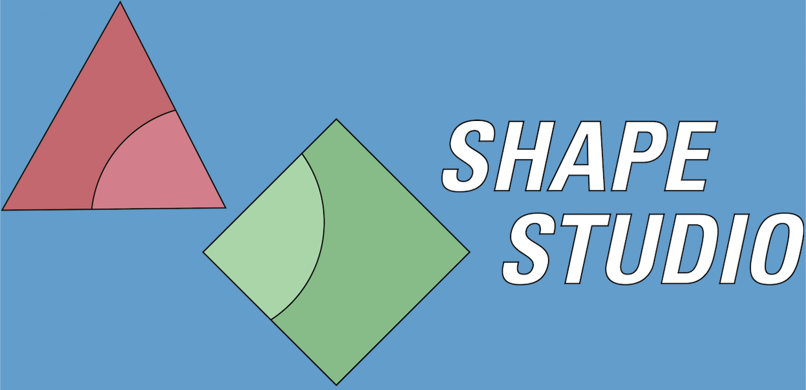

# Shape Studio

An in-browser 3D modeling application which allows users to create simple 3D objects.

## How It Works

Once a user creates an account or signs in, they're presented by a view of an empty 3D space with a grid helper to assist with orientation. A user can use the site UI to generate basic shapes and then manipulate them via the object's transform controls. A user can also save their work on their models and come back to them later.

## Built Using?

Shape Studio is built with a Rails backend which handles user authentication as well as saving/loading a user's Scenes or Models. The frontend is built with React, ThreeJS, and React-Three-Fiber, which handles the actual generation, display, and manipulation of the 3D shapes.

## Software Requirements

- Ruby on Rails
- Node.JS

## How to Run (frontend)

- Clone this repo as well as the [backend repo](https://github.com/ktomanelli/ShapeStudio_backend), navigate to the project root in your terminal.
- Run `npm start`
